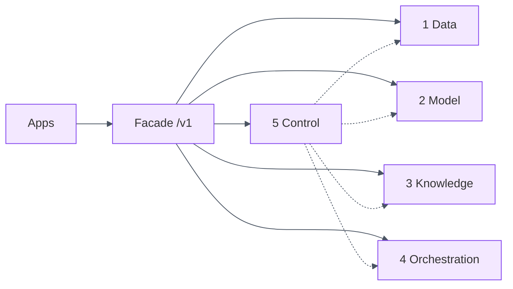

# enterprise-ai-platform-planes

[](./.github/workflows/ci.yml)

> Enterprise AI organized into **five planes** — Data, Model, Knowledge, Orchestration, Control —
> accessed only through a **versioned platform facade**. Product teams own use cases and outcomes;
> the platform supplies reusable, governed capabilities so model or framework changes do not
> rewrite every application.

Part of the [Enterprise Platform Reference Architecture](../README.md). This repo is the
**organizing architecture** that wires:

| Plane | Portfolio implementation |
|---|---|
| Data | `streaming-lakehouse-platform` · `supplier-golden-record-platform` · `item-cost-ledger-platform` |
| Model | **Model gateway** (this repo) — approved catalog, routing, embeddings, endpoints |
| Knowledge | `agentic-rag-engine` |
| Orchestration | `governed-mcp-gateway` · Temporal · LangGraph · `pricing-orchestration` |
| Control | MCP audit · RAG eval · OTel · `finops-platform-landing-zone` |

## Five planes

```
┌─────────────────────────────────────────────────────────────────────┐
│                         PRODUCT APPLICATIONS                          │
└───────────────────────────────┬─────────────────────────────────────┘
                                │  /v1/* APIs — never provider SDKs
┌───────────────────────────────▼─────────────────────────────────────┐
│                         PLATFORM FACADE                               │
└─┬─────────┬─────────┬─────────┬─────────┬────────────────────────────┘
  ▼         ▼         ▼         ▼         ▼
 DATA     MODEL    KNOWLEDGE  ORCH      CONTROL
 lakehouse catalog  retrieve   agents    policy
 Kafka     route    rerank     HITL      audit
 lineage   embed    entities   tools     FinOps
```



## Architectural principle

> Applications access these capabilities through **versioned APIs or SDKs** rather than
> integrating directly with every model provider. **Separation of concerns**: product teams own
> use cases and outcomes; the platform supplies reusable, governed capabilities.

## Run

### Tests (no infra, optional FastAPI)
```bash
python -m venv .venv && source .venv/bin/activate
pip install pytest
pytest -q
./scripts/demo.sh
```

### API
```bash
pip install fastapi uvicorn pydantic
PYTHONPATH=src uvicorn ai_planes.api:app --reload --port 8088
# GET  /v1/platform
# GET  /v1/models
# POST /v1/chat
# POST /v1/retrieve
# POST /v1/orchestrate
# GET  /v1/control/audit
```

## Facade surface

| Endpoint | Plane |
|---|---|
| `GET /v1/platform` | Discovery |
| `GET /v1/models` · `POST /v1/chat` | Model (+ Control) |
| `POST /v1/retrieve` | Knowledge |
| `POST /v1/orchestrate` | Orchestration |
| `GET /v1/data/*` · `POST /v1/data/authorize` | Data |
| `GET /v1/control/audit` · `/finops` · `/traces` | Control |

## Documentation

- [`docs/SYSTEM-DESIGN.md`](docs/SYSTEM-DESIGN.md) — planes, SLOs, request path
- [`docs/PORTFOLIO-WIRING.md`](docs/PORTFOLIO-WIRING.md) — maps to existing GitHub repos
- [`docs/INDUSTRY-APPLICABILITY.md`](docs/INDUSTRY-APPLICABILITY.md) — retail / banking / healthcare
- **[`docs/DECISION-MATRIX-MODELS-FRAMEWORKS.md`](docs/DECISION-MATRIX-MODELS-FRAMEWORKS.md)** — model & framework decision matrix (catalog / gateway)
- ADRs: [`docs/adr/`](docs/adr/)

## Toolbox

`Python` · `FastAPI` · `Model Gateway` · `Hybrid Retrieval` · `MCP/HITL patterns` · `Hash-chained Audit` ·
`FinOps metering` · `OpenTelemetry-style spans` · `Azure OpenAI catalog` · `TOGAF` (executable EA)
