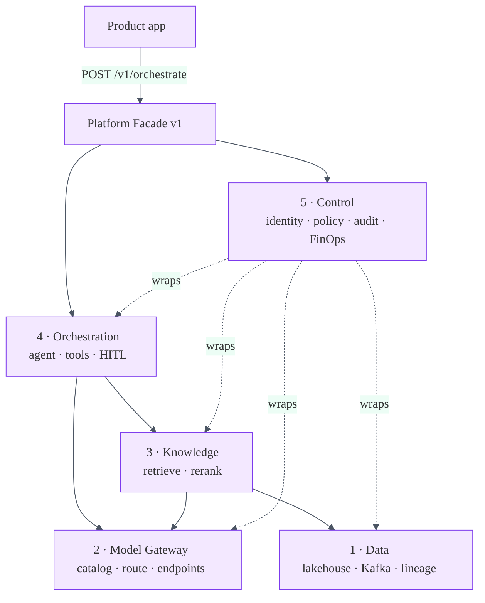

# System Design: Enterprise AI Platform Planes

## 1. Problem
Enterprises need reusable, governed AI capabilities so product teams deliver outcomes
without integrating every model provider, vector store, and agent framework directly.

## 2. Architectural principle
**Separation of concerns.** Product teams own use cases and outcomes; the platform
supplies reusable, governed capabilities across five planes. Model or framework changes
must not rewrite every application.

## 3. Five planes (unique stack diagram)

```
┌─────────────────────────────────────────────────────────────────────┐
│                         PRODUCT APPLICATIONS                          │
│              (use cases · outcomes · domain UX)                      │
└───────────────────────────────┬─────────────────────────────────────┘
                                │  versioned APIs / SDKs (/v1/*)
┌───────────────────────────────▼─────────────────────────────────────┐
│                         PLATFORM FACADE                               │
└─┬─────────┬─────────┬─────────┬─────────┬────────────────────────────┘
  │         │         │         │         │
  ▼         ▼         ▼         ▼         ▼
┌────┐   ┌────┐   ┌────┐   ┌────┐   ┌────┐
│ 1  │   │ 2  │   │ 3  │   │ 4  │   │ 5  │
│DATA│   │MODEL│  │KNOW│   │ORCH│   │CTRL│
└────┘   └────┘   └────┘   └────┘   └────┘
```

| # | Plane | Responsibilities |
|---|---|---|
| 1 | **Data** | Governed lakehouse, operational APIs, Kafka events, metadata, lineage, access policy |
| 2 | **Model** | Approved catalog, gateway, routing, versioning, embeddings, model endpoints |
| 3 | **Knowledge** | Ingestion, chunking, vector + keyword indexes, entity resolution, retrieval, reranking |
| 4 | **Orchestration** | Workflow state, agents, tool registry, memory, human approval, deterministic services |
| 5 | **Control** | Identity, policy, prompt/model governance, evaluation, tracing, observability, audit, FinOps |

## 4. Mermaid — request path



## 5. SLOs (platform facade)

| Concern | Target |
|---|---|
| `/v1/retrieve` p99 | < 300 ms (local indexes) |
| `/v1/chat` p99 | < 2.5 s (excl. external LLM when wired) |
| Audit chain integrity | 100% `verify() == true` |
| Ungoverned provider calls from apps | 0 (enforced by review) |
| Model spend attribution | 100% of chat calls metered |

## 6. Portfolio wiring

See [`PORTFOLIO-WIRING.md`](PORTFOLIO-WIRING.md).

## 7. Capacity sketch
- Catalog: tens of approved models (not thousands of shadow fine-tunes).
- Facade horizontally scales; state is correlation + audit append + FinOps counters.
- Heavy retrieval/embedding load stays in knowledge/model plane workers.
